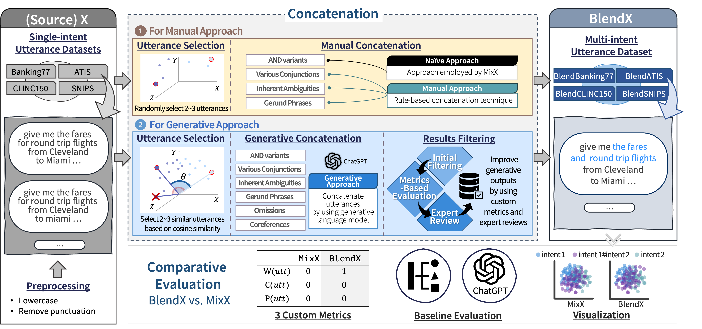

# BlendX : Complex Multi-Intent Detection with Blended Patterns

## Coming Soon!

This repository will soon host the **BlendX Dataset**, a comprehensive and detailed dataset designed for advancing research in task-oriented dialogue (TOD) systems, specifically focusing on multi-intent detection (MID) within utterances.

### Abstract

Task-oriented dialogue (TOD) systems are commonly designed with the presumption that each utterance represents a single intent. However, this assumption may not accurately reflect real-world situations, where users frequently express multiple intents within a single utterance. While there is an emerging interest in multi-intent detection (MID), existing in-domain datasets such as MixATIS and MixSNIPS have limitations in their formulation. To address these issues, we present BlendX, a suite of refined datasets featuring more diverse patterns than their predecessors, elevating both its complexity and diversity. For dataset construction, we utilize both rule-based heuristics as well as a generative tool -- OpenAI's ChatGPT -- which is augmented with a similarity-driven strategy for utterance selection. To ensure the quality of the proposed datasets, we also introduce three novel metrics that assess the statistical properties of an utterance related to word count, conjunction use, and pronoun usage. Extensive experiments on BlendX reveal that state-of-the-art MID models struggle with the challenges posed by the new datasets, highlighting the need to reexamine the current state of the MID field. The dataset is available at https://github.com/HYU-NLP/BlendX.

> An overview of the BlendX construction framework. Initially, we preprocess four source datasets: ATIS, Banking77, CLINC150, and SNIPS. We then select single-intent utterances from these datasets. These utterances are combined using both Manual and Generative approaches. It is important to note that utterances are kept separate and not mixed across datasets. Following the merging process, all resultant datasets are compiled to form BlendX. We particularly highlight non-trivial combinations, such as omissions, which are indicated within the blue rounded box on the rightmost side of the framework. Finally, BlendX is evaluated using three methods: custom metrics, baseline evaluation, and visualization.

### Dataset Description

The BlendX dataset comprises a suite of refined datasets with a focus on multi-intent detection in task-oriented dialogues. It introduces more diverse patterns of utterance formulation, challenging the existing MID models with its elevated complexity and diversity.

### Access

The dataset will be available for download directly from this repository. Detailed instructions for accessing and utilizing the dataset will be provided upon release.
